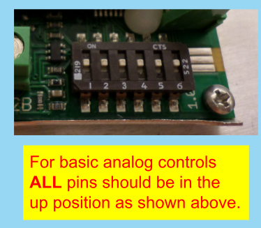
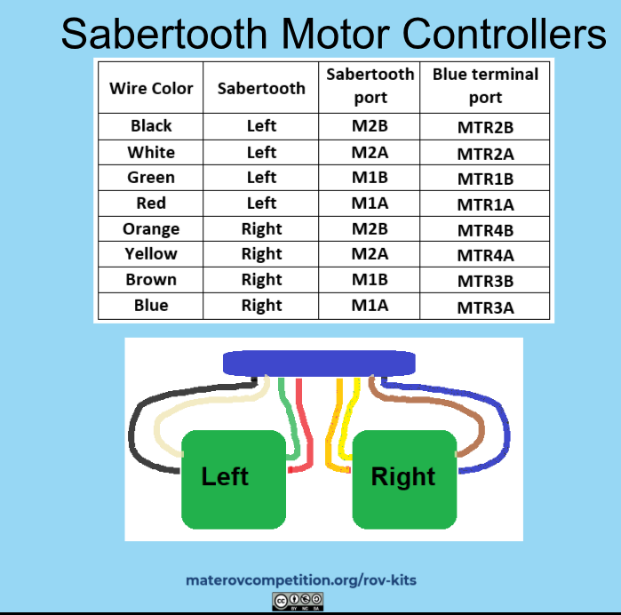
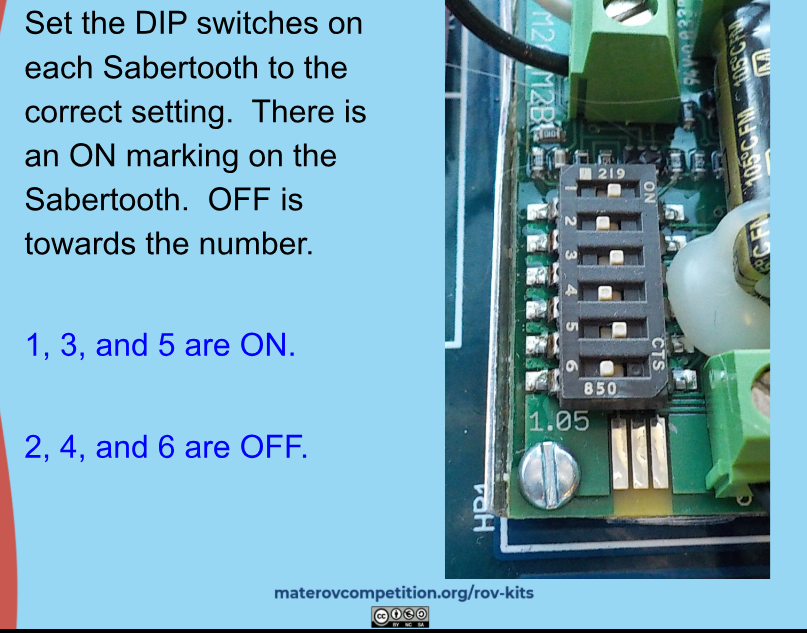

# Repair Guide

This guide provides troubleshooting steps and solutions for common issues with your ROV system. Use the table of contents to quickly find the section you need.

---

## Table of Contents

1. [General Troubleshooting](#general-troubleshooting)
2. [Switching Modes (Analog/Digital)](#switching-modes-analogdigital)
3. [Motor Issues](#motor-issues)
    - [Joystick Drift](#joystick-drift)
    - [Sabertooth Controller Issues](#sabertooth-controller-issues)
4. [Camera Issues](#camera-issues)
5. [Portable Power Generator Issues](#portable-power-generator-issues)
6. [Software Issues](#software-issues)
    - [Basic Joystick Code](#basic-joystick-code)
    - [Depth Sensor Code](#depth-sensor-code)
7. [Resources](#resources)

---

## General Troubleshooting

- If things are not turning on, or staying on when they shouldn't, check:
    - All power connections and switches
    - That the generator is charged and DC output is enabled
    - All cables and connectors for looseness or damage

---

### Switching from Digital to Analog Mode

To test if the motors are malfunctioning a good place to start is by switching them back to analog mode. This means instead of using the Arduino to run the motors, the robot is simply using the electronic signals from the joystick potentiometer to control the movements.

First turn off the robot. Disconnect it completely from power. 

For analog mode, the sabertooth controller needs to be set to the correct pins/dip switch settings. Both controllers should have all the pins set to the "on" position. 

Finally to switch to analog mode all 4 jumpers need to be connected to the "C2" position as seen below.

If there is issues with the control box build refer back to the [Control Box Build Guide by SeaMate](https://docs.google.com/presentation/d/e/2PACX-1vRtIemncL3JVpDB7jIuYOOvCOdgGI8xzUyhYJl8N8HHexPyqrFNaqludSkgZgUaFctHBfSlmvy4tpxE/pub?start=false&loop=false&delayms=3000&slide=id.p)

If things are working in analog mode, then the issue is likely with the Arduino or the code. If things are not working in analog mode, then the issue is likely with the sabertooth controller or the motors or something hardware related.

#### Summary of Steps to Switch to Analog Mode

1. **Power Off:** Turn off and disconnect the robot from power.
2. **Set Sabertooth DIP Switches:** Set all DIP switches to the "ON" position on both controllers.
    - 
3. **Set Jumpers:** Connect all 4 jumpers to the "C2" position.
    - 
4. **Test:** If motors work in analog mode, the Arduino/code may be the issue. If not, check the Sabertooth controller, motors, or hardware.

### Reverting Back to Digital Mode from Analog Mode

To switch back to digital mode, the sabertooth controller needs to be set to the correct pins. 1,3,5 are on and 2,4,6 are off for both controllers.

 

**The 4 jumpers should be set to the "C1" position**.

If there are more issues with the control box being converted back to digital mode, refer to the [Control Box Build Digital Guide by SeaMate](https://docs.google.com/presentation/d/e/2PACX-1vSaJHo9mUlmZ_VFU7EeYjHr5jsFbRT6R-QFL30TU9lDHdw7xt-9oLNg8te0xLp8fXEJK5ztT22pUU_C/pub?start=false&loop=false&delayms=3000&slide=id.p1).

#### Summary of Steps to Switch to Digital Mode

1. **Set Sabertooth DIP Switches:** Set switches 1, 3, 5 ON and 2, 4, 6 OFF for both controllers.
    - 
2. **Set Jumpers:** Move all 4 jumpers to the "C1" position.
3. **Test:** If issues persist, see the digital control guide.

[Control Box Build Digital Guide by SeaMate](https://docs.google.com/presentation/d/e/2PACX-1vSaJHo9mUlmZ_VFU7EeYjHr5jsFbRT6R-QFL30TU9lDHdw7xt-9oLNg8te0xLp8fXEJK5ztT22pUU_C/pub?start=false&loop=false&delayms=3000&slide=id.p1)

---

## Motor Issues

### Joystick Drift

If the joystick is drifting, it may be due to a bad potentiometer. You can tell this is an issue if one or more of the motors never fully turns off. The potentiometer is the component inside the joystick that detects the position of the joystick. If it is not working properly, it can cause the robot to drift in one direction or another. You can test this to see if there is any position the motors are fully stopping by gently moving the joystick in all directions and seeing if the motors stop or get any closer to stopping. This means the home setting of the joystick is not actually where the motors are stopping anymore. This can happen overtim by wear and tear on the joystick or if the joystick is dropped or damaged.

To fix this the best solution is to replace the joystick. You can buy the joystick separately or the whole kit from [SeaMate](https://seamate.org/collections/barracuda-rov/products/sabertooth-joystick-replacement-kit).

- **Symptoms:** Motors never fully turn off or drift.
- **Cause:** Bad potentiometer in the joystick.
- **Test:** Gently move the joystick in all directions; if motors never stop, the potentiometer is likely worn or damaged.
- **Solution:** Replace the joystick. [SeaMate Joystick Kit](https://seamate.org/collections/barracuda-rov/products/sabertooth-joystick-replacement-kit)

### Sabertooth Controller Issues

First check all the wires connected to the sabertooth. The sabertooth controller on the left controlls the left and right (horizontal) motors while the one on the right controls the crab and vertical motors. Check all the wires are secure in the sabertooth. 
They can loosen overtime since they are connected through a screw connection. Tighten the screws with the wires in the slots to ensure they are secure.

If the motors continue to not work and the sabertooth controller is flashing red or not working even with the pins the correct spots it may mean that the controller needs replaced. You can buy one separately or from [SeaMate](https://seamate.org/collections/barracuda-rov/products/sabertooth-joystick-replacement-kit).

Replacing the sabertooth requires unscrewing all the wires, taking out the PCB board carefully, and unscrewing the controller from the board. Use some **heatsink compound** on the back of the new controller before putting it in. This helps to make sure it does not overheat. Screw all the pieces and wires back in their original positions.

For more information on the sabertooth controller, refer to the [Sabertooth Powerpoint by SeaMate](https://docs.google.com/presentation/d/e/2PACX-1vRFP-ZPQkCo_Jx7r8_KIzDjlaPUm8ab588ryvPmsn5yvhOffjHJ8nfAnJD0QdS-N_Us_cYrgIzRN6ts/pub?start=false&loop=false&delayms=3000&slide=id.g15f7ea19d6_0_14)

- **Check:** All wires are secure and screws are tight.
- **Symptoms:** Motors not working, controller flashing red, or not responding.
- **Solution:** Replace the controller if faulty. Use heatsink compound on the new controller before installation.
    - 
- [Sabertooth Powerpoint by SeaMate](https://docs.google.com/presentation/d/e/2PACX-1vRFP-ZPQkCo_Jx7r8_KIzDjlaPUm8ab588ryvPmsn5yvhOffjHJ8nfAnJD0QdS-N_Us_cYrgIzRN6ts/pub?start=false&loop=false&delayms=3000&slide=id.g15f7ea19d6_0_14)

---

## Camera Issues

There are two different cameras included with this setup. The first is the video system that came with the [SeaMate kit](https://seamate.org/products/triggerfish-barracuda-video-system-kit) and the second one is a [portable fish finder camera](https://www.amazon.com/Underwater-Equipped-Infrared-Function-Waterproof/dp/B0DQ7QVVC3/ref=sr_1_40?dib=eyJ2IjoiMSJ9.ZN-pz-x6PIxM067TyiM5YU591EIKEPAYmWC94bFw0trDaXVttTN0WD7OhYgAdGaYALeyxgSps5HCnjuzIiydn0BhZoAdbGs2VhO-kvR_9LzQxENwhjyAiYs3Opv9akBdAjmkE0XhfHBVT7cl0qAYoAS2rv_UOQb_bBXv1DT3Rhw0iNnZg5xckq5Kusu7Ew-occYkgH5HXuc8b5MhfTHniw.clFft-ms6vkWReCPmpN6-k-DJ7-n1aUh9c9aH2FCPFg&dib_tag=se&keywords=portable+fish+finder&qid=1748966464&sr=8-40&xpid=LmiA5GRm8vYzw) that can be used as a backup.

The SeaMate video system is directly connected to the controller box. The biggest issue with the system is the pins on monitor plug are extremely fragile. Plugging from the monitor to the controller box should be done carefully and not forced. If the pins are bent, they can be straightened with a small screwdriver or tweezers. Then the camera system (the long black wire on the ROV) can be plugged into the controller box. Plug the yellow ended wire into the box on either the first or the second port on the box. Then connect the power wire from the box (the round hole) to the red end on the black cable. If there is an issue with the camera not turning on, check the power wire is connected properly. If it is not, the camera will not turn on.
If the camera is not working, check the monitor is plugged in properly and the pins are not bent. Try pushing the power button on the monitor and switching settings.  

An alternative is to use the portable fish finder camera. This camera is not as high quality as the SeaMate camera, but it can be used in a pinch. The camera has a USB charger and has to have the wire jack plugged in before turning it on. When turning it off you **MUST** turn off the LED if you turned it on and do not unplug the wire jack until it is turned off. 

- **SeaMate Video System:**
    - Handle monitor plug pins carefully; straighten bent pins with tweezers.
    - Ensure all connections are secure and power is supplied.
    - Try switching monitor settings if no image.
- **Portable Fish Finder Camera:**
    - Plug in wire jack before turning on.
    - Turn off LED before unplugging.
    - Lower quality but useful as a backup.

---

## Portable Power Generator Issues

This project utilizes a portable power generator to power the ROV. If the generator is not working, it may be due to a few common issues. First check that the generator is charged. If it is not, plug it in and let it charge for a few hours.

If the generator is charged and still not working, check the power switch on the generator. Make sure it is turned on. To use the DC output plug the button below the plug that says "DC Output" must be pressed. If the button is not pressed, the DC output will not work.

- **Check:** Generator is charged and switched on.
- **DC Output:** Press the "DC Output" button below the plug to enable.

---

## Software Issues

Software issues can be tricky to diagnose. If the robot is not responding to the joystick or the motors are not moving the way you want, it may be due to a software issue. Using the Arduino IDE, you can check the code to see if there are any errors.

### Basic Joystick Code

A good place to start is with the basic joystick code. This code is a simple test to see if the joystick is working properly. If the joystick is not working, it may be due to a bad potentiometer or a bad connection.

Make sure that you have the correct libraries installed in the Arduino IDE. The libraries needed for the joystick code are `Servo.h` and `Sabertooth.h`. You can install these libraries by going to Sketch > Include Library > Manage Libraries in the Arduino IDE and searching for the libraries.

For the sabertooth library you can find it [here](https://drive.google.com/file/d/1XVHdcrWwW5eN3FOgLWoECL7wGsmbUZU8/view) and drag it into the libraries folder in the Arduino IDE.
You can find the basic joystick code in the `repair_guide_code\joystick_basic.ino` file. Upload this code to the Arduino and see if the joystick is working properly. If it is not, you may need to replace the joystick or check the connections.

If there are still issues check out the [SeaMate Digital Control Guide](https://docs.google.com/presentation/d/e/2PACX-1vSaJHo9mUlmZ_VFU7EeYjHr5jsFbRT6R-QFL30TU9lDHdw7xt-9oLNg8te0xLp8fXEJK5ztT22pUU_C/pub?start=false&loop=false&delayms=3000&slide=id.p1)

- **Libraries Needed:** `Servo.h`, `Sabertooth.h`
    - Install via Arduino IDE: Sketch > Include Library > Manage Libraries
    - [Sabertooth Library Download](https://drive.google.com/file/d/1XVHdcrWwW5eN3FOgLWoECL7wGsmbUZU8/view)
- **Test Code:** See `repair_guide_code\joystick_basic.ino`
- **If not working:** Replace joystick or check wiring.

### Depth Sensor 

Another common issue is with the depth sensor. If the depth sensor is not working, it may be due to a bad connection or a bad sensor. Check the connections to the sensor and make sure they are secure. If the connections are secure and the sensor is still not working, you may need to replace the sensor. 

Alternatively the problem could be in the code is not reading the sensor properly. At the time of this guide the project uses the [Blue Robotics Bar30 sensor](https://bluerobotics.com/store/sensors-cameras/sensors/bar30-sensor-r1/). The code for the sensor can be found in the `repair_guide_code\depth_sensor.ino` file. Make sure you have the correct libraries installed in the Arduino IDE. The libraries needed for the depth sensor code are `Wire.h` and the [`MS5837` Arduino Library](https://github.com/bluerobotics/BlueRobotics_MS5837_Library). You can install these libraries by going to Sketch > Include Library > Manage Libraries in the Arduino IDE and searching for the libraries.

Please note this sensor must be allowed to dry in air once per day for at least 2 hours, or the pressure and temperature readings will drift.

Another issue this sensor runs into is that if the sensor is reading abnormally large numbers it may be in contact with a motor or hitting a wall. The sensor should be at least 10cm away from any motors or walls to get an accurate reading. If the sensor is too close, it may read a pressure that is not accurate.

Another thing to check is that the water proofing is intact. If the sensor is not water proofed properly, it may not work properly. Check the sensor for any cracks or damage to the casing. If there is damage, you may need to replace the sensor. Using [coax seal](https://atlas-scientific.com/waterproofing/coax-sealer/).

- **Libraries Needed:** `Wire.h`, [`MS5837` Arduino Library](https://github.com/bluerobotics/BlueRobotics_MS5837_Library)
- **Test Code:** See `repair_guide_code\depth_sensor.ino`
- **Install libraries:** Arduino IDE > Manage Libraries

- **Check:** All connections are secure.
- **Sensor Used:** [Blue Robotics Bar30](https://bluerobotics.com/store/sensors-cameras/sensors/bar30-sensor-r1/)
- **Common Issues:**
    - Abnormally large readings: Sensor too close to motors/walls (keep >10cm away).
    - Water proofing: Inspect for cracks/damage; use [coax seal](https://atlas-scientific.com/waterproofing/coax-sealer/).
    - Let sensor dry in air for at least 2 hours daily to prevent drift.

---

## Resources

- [SeaMate Barracuda ROV Parts](https://seamate.org/collections/barracuda-rov)
- [SeaMate Video System Kit](https://seamate.org/products/triggerfish-barracuda-video-system-kit)
- [Portable Fish Finder Camera (Amazon)](https://www.amazon.com/Underwater-Equipped-Infrared-Function-Waterproof/dp/B0DQ7QVVC3/)
- [Blue Robotics Bar30 Sensor](https://bluerobotics.com/store/sensors-cameras/sensors/bar30-sensor-r1/)
- [Coax Seal Waterproofing](https://atlas-scientific.com/waterproofing/coax-sealer/)

---